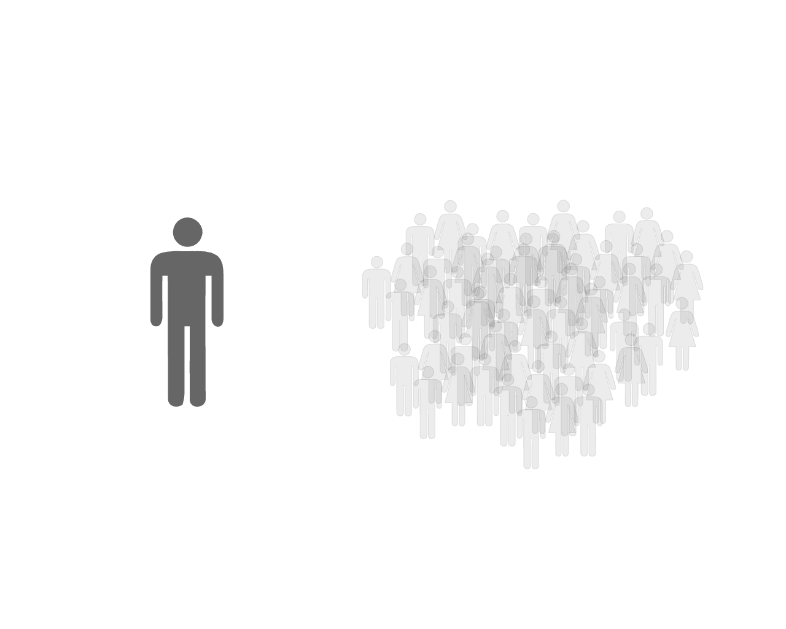

```{r setup, include=FALSE}
options(htmltools.dir.version = FALSE)
knitr::opts_chunk$set(message = F,error = F,comment = F)
require(kableExtra)
require(tidyverse)
```

.center[
### Boko Haram
 ]
.center[
### Abu Sayyaf
 ]


---

## Tactical Experimentation

.center[ ]

---

.center[  ]

---

<!-- .center[  ] -->

<!-- --- -->

<!-- .center[  ] -->

<!-- --- -->

<!-- .center[  ] -->

<!-- --- -->

.center[  ]

---

.center[  ]

---

### Knowledge diversity

.center[  ]


---

### Endogenous learning

.center[  ]


---

## Simulation 

.center[  ]

---

## Diversity Conditions
<br><br>

.center[  ]

---

<br><br><br><br>

.center[  ]

---

<br>

### Hypothesis 1
Violent Non-State Organizations with heterogeneous members will have higher levels of tactical experimentation than organizations with homogeneous members.

### Hypothesis 2
As Violent Non-State Organizations age, they are less likely to vary tactics.

### Hypothesis 3
Given heterogeneous membership, Violent Non-State Organizations with highly committed members will be more likely to experiment with tactics than organizations with less committed members.

---

### Measuring tactical experimentation

.center[  ]

---

### Measuring tactical experimentation

.center[  ]

---

### Measuring tactical experimentation

.center[  ]


---


### Measuring membership diversity &rarr; ethnic exposures

.center[  ]

---

.center[  ]

---

### Data

<table style="text-align:center"><tr><td colspan="6" style="border-bottom: 1px solid black"></td></tr><tr><td style="text-align:left">Statistic</td><td>N</td><td>Mean</td><td>St. Dev.</td><td>Min</td><td>Max</td></tr>
<tr><td colspan="6" style="border-bottom: 1px solid black"></td></tr><tr><td style="text-align:left">Tactical Innovations</td><td>3,139</td><td>1.6</td><td>2.4</td><td>0</td><td>30</td></tr>
<tr><td style="text-align:left">Tactics Used</td><td>3,139</td><td>1.8</td><td>1.5</td><td>1.0</td><td>15.5</td></tr>
<tr><td style="text-align:left">Tactical Variation</td><td>3,139</td><td>1.3</td><td>0.8</td><td>0.0</td><td>6.0</td></tr>
<tr><td style="text-align:left">Diversity</td><td>3,139</td><td>1.3</td><td>1.2</td><td>0</td><td>3</td></tr>
<tr><td style="text-align:left">Novel Exposure</td><td>3,139</td><td>0.2</td><td>0.4</td><td>0</td><td>1</td></tr>
<tr><td style="text-align:left">Resource Exposures</td><td>3,139</td><td>0.5</td><td>1.8</td><td>0</td><td>39</td></tr>
<tr><td style="text-align:left">Organization Age</td><td>3,139</td><td>12.7</td><td>10.0</td><td>2</td><td>49</td></tr>
<tr><td style="text-align:left">Organization Age2</td><td>3,139</td><td>261.2</td><td>386.6</td><td>4</td><td>2,401</td></tr>
<tr><td style="text-align:left">Repertoire Size</td><td>3,139</td><td>14.9</td><td>11.3</td><td>1</td><td>65</td></tr>
<tr><td style="text-align:left">Geographic Coverage (Cummulative)</td><td>3,139</td><td>12.5</td><td>14.6</td><td>1</td><td>156</td></tr>
<tr><td style="text-align:left">Geographic Coverage (Discrete)</td><td>3,139</td><td>1.7</td><td>1.7</td><td>1</td><td>26</td></tr>
<tr><td style="text-align:left">N Events</td><td>3,139</td><td>3.1</td><td>5.7</td><td>1.0</td><td>89.8</td></tr>
<tr><td style="text-align:left">Cold War</td><td>3,139</td><td>0.7</td><td>0.5</td><td>0</td><td>1</td></tr>
<tr><td colspan="6" style="border-bottom: 1px solid black"></td></tr></table>

---

## Results

<br><br>
<table style="text-align:center"><caption><strong>Membership diversity on tactical variation</strong></caption>
<tr><td colspan="4" style="border-bottom: 1px solid black"></td></tr><tr><td style="text-align:left"></td><td>Innovations</td><td>Usage</td><td>Variation</td></tr>
<tr><td colspan="4" style="border-bottom: 1px solid black"></td></tr><tr><td style="text-align:left"><font color="darkred">Diversity</font></td><td><font color="darkred">.43<sup>**</sup> (.18)</td><td><font color="darkred">.09<sup>***</sup> (.01)</td><td><font color="darkred">.11<sup>***</sup> (.005)</td></tr>
<tr><td style="text-align:left">Org. Age</td><td>-.16<sup>***</sup> (.06)</td><td>-.02<sup>***</sup> (.002)</td><td>-.02<sup>***</sup> (.001)</td></tr>
<tr><td style="text-align:left">Org. Age 2</td><td>.003<sup>***</sup> (.001)</td><td>.0002<sup>***</sup> (0.0000)</td><td>.0003<sup>***</sup> (0.0000)</td></tr>
<tr><td colspan="4" style="border-bottom: 1px solid black"></td></tr><tr><td style="text-align:left">Observations</td><td>2,840</td><td>2,840</td><td>2,840</td></tr>
<tr><td style="text-align:left">R<sup>2</sup></td><td>.38</td><td>.88</td><td>.63</td></tr>

---

## Results

<table style="text-align:center"><caption><strong>Membership diversity and resource exposure on tactical variation</strong></caption>
<tr><td colspan="4" style="border-bottom: 1px solid black"></td></tr><tr><td style="text-align:left"></td><td>Innovations</td><td>Usage</td><td>Variation</td></tr>
<tr><td colspan="4" style="border-bottom: 1px solid black"></td></tr><tr><td style="text-align:left">Diversity</td><td>.41<sup>**</sup> (.17)</td><td>.09<sup>***</sup> (.01)</td><td>.11<sup>***</sup> (.004)</td></tr>
<tr><td style="text-align:left"><font color="darkred">Resource Exposure</td><td><font color="darkred">-.09 (.43)</td><td><font color="darkred">.09<sup>***</sup> (.02)</td><td><font color="darkred">.12<sup>***</sup> (.01)</td></tr>
<tr><td style="text-align:left"><font color="darkred">Diversity X Resource Exposure</td><td><font color="darkred">-.09 (.16)</td><td><font color="darkred">-.11<sup>***</sup> (.01)</td><td><font color="darkred">-.09<sup>***</sup> (.003)</td></tr>
<tr><td style="text-align:left">Org. Age</td><td>-.16<sup>***</sup> (.06)</td><td>-.02<sup>***</sup> (.002)</td><td>-.03<sup>***</sup> (.001)</td></tr>
<tr><td style="text-align:left">Org. Age 2</td><td>.003<sup>***</sup> (.001)</td><td>.0002<sup>***</sup> (0.0000)</td><td>.0004<sup>***</sup> (0.0000)</td></tr>
<tr><td colspan="4" style="border-bottom: 1px solid black"></td></tr><tr><td style="text-align:left">Observations</td><td>2,840</td><td>2,840</td><td>2,840</td></tr>
<tr><td style="text-align:left">R<sup>2</sup></td><td>.40</td><td>.90</td><td>.65</td></tr>
</table>


---

<br>
.center[
# Thanks!
<br>
.center[
### Eric Dunford 
_McCourt School of Public Policy_<br>
**_Georgetown University_**<br>
eric.dunford@georgetown.edu<br>
[ericdunford.com](http://ericdunford.com/)
]
]


